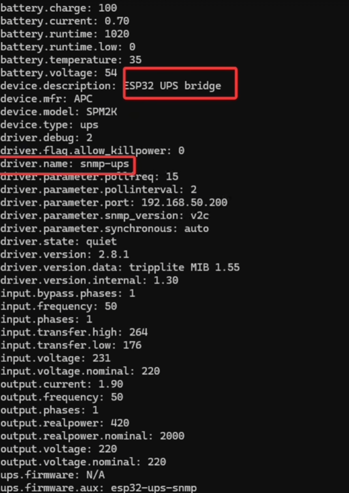

# ESP32 UPS Serial to SNMP

This project runs on an **ESP32-C3** and bridges an APC UPS serial interface to a lightweight SNMP agent over Wi‑Fi.

## Hardware required
- **MAX3232/SP3232 (or equivalent) RS232 To TTL Converter Module is required.**
	The UPS serial port uses RS‑232 voltage levels; the ESP32 UART is 3.3V TTL. Do not connect the UPS RS‑232 lines directly to the ESP32.

## What it does
- Reads UPS telemetry over UART (default: `2400` baud).
- Starts a Wi‑Fi station client.
- Exposes UPS values via SNMP (`UDP/161`, community string configurable).

## Quick configuration
Edit `platformio.ini` build flags:
- `UPS_WIFI_STA_SSID`
- `UPS_WIFI_STA_PASSWORD`
- `UPS_SNMP_COMMUNITY`

Optional UART overrides (also via build flags):
- `UPS_UART_TX_GPIO` (default `0`)
- `UPS_UART_RX_GPIO` (default `1`)
- `UPS_UART_BAUDRATE` (default `2400`)

UART selection note: some ESP32-C3 dev boards use a hardware UART for bootloader flashing, firmware download, and/or serial logging. If upload/monitor stops working or you see mixed debug output, keep the UPS on a different UART and choose non-conflicting TX/RX GPIOs.

## Build and flash
From the project root:

```bash
platformio run
platformio run -t upload
platformio device monitor
```

Default PlatformIO environment: `esp32-c3-devkitm-1`.

## License
See `LICENSE`.
